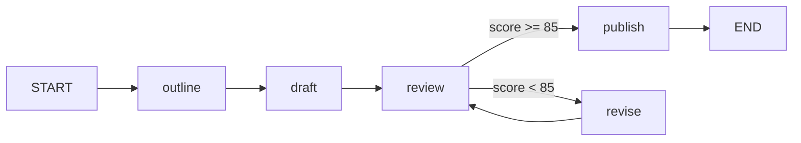

# 02 - 学习助教完整工作流

这一节是整个项目的核心：做一个“学习助教 / 文档生成工作流”。

## 工作流目标

输入一个主题后，图会依次完成：

1. 生成提纲
2. 生成初稿
3. 审阅初稿
4. 条件分支决定是否修订
5. 必要时循环修订
6. checkpoint 暂停并恢复
7. 发布最终文档

## 为什么这样设计

- LangGraph4j 负责流程编排
- LangChain4j 负责节点内部的模型调用
- state 负责在节点之间传递数据
- checkpoint 负责暂停、查看、恢复

## 代码结构

- `assistant/DocumentWorkflowAssistant.java`
- `assistant/LangChainConfig.java`
- `workflow/LearningAssistantState.java`
- `workflow/OutlineNode.java`
- `workflow/DraftNode.java`
- `workflow/ReviewNode.java`
- `workflow/ReviseNode.java`
- `workflow/PublishNode.java`
- `workflow/LearningAssistantWorkflowService.java`

## 关键流程

## checkpoint 的位置

这版把断点放在 `publish` 前面。

原因很简单：

- 前面有循环
- 如果把断点放在 `review`，循环回来会反复停
- 放在 `publish` 前面，更适合完整案例演示

